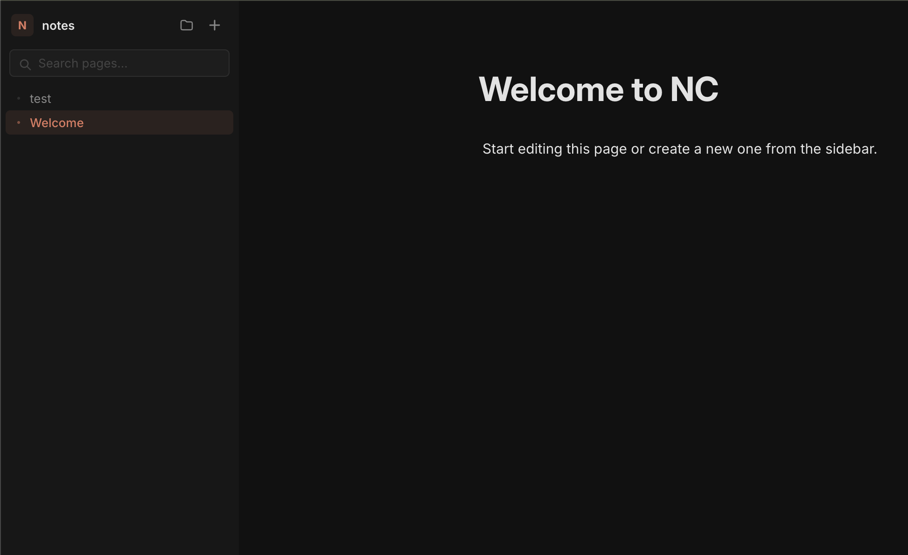

# Notemark

A minimal local-first note-taking app. Your pages live as plain markdown files on your own machine — no accounts, no sync, no cloud.



## How it works

Pick a folder on your machine. NC reads and writes `.md` files directly to that folder using the [File System Access API](https://developer.mozilla.org/en-US/docs/Web/API/File_System_API). Nothing leaves your computer.

## Features

- **Block editor** — paragraphs, headings, lists, quotes, code, and dividers
- **Slash commands** — type `/` to insert any block type
- **Drag to reorder** — grab the handle to reorder blocks
- **Live search** — filter pages instantly from the sidebar
- **Auto-save** — changes are written to disk 800ms after you stop typing
- **Persistent folder** — remembers your folder across sessions via IndexedDB

## Requirements

Chrome or Edge (desktop). The File System Access API is not available in Firefox or Safari.

## Getting started

```bash
git clone https://github.com/you/nc.git
cd nc
npm install
npm start
```

Then open `http://localhost:3000` in Chrome or Edge and pick a folder.

## Development

```bash
npm run dev   # starts server with file watching via nodemon
```

## Stack

- **Backend** — Node.js + Express (serves static files and nothing else)
- **Frontend** — Vanilla JS, no build step, no frameworks
- **Storage** — File System Access API + IndexedDB (for handle persistence)
- **Fonts** — Inter (UI), JetBrains Mono (code blocks)

## Project structure

```
nc/
├── server.js          # Express server
├── public/
│   ├── index.html
│   ├── style.css
│   └── app.js
└── pages/             # Your markdown files live here (or wherever you point it)
```

## License

MIT
